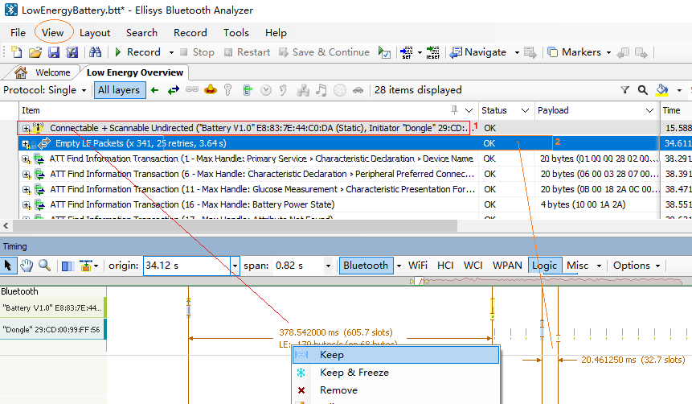
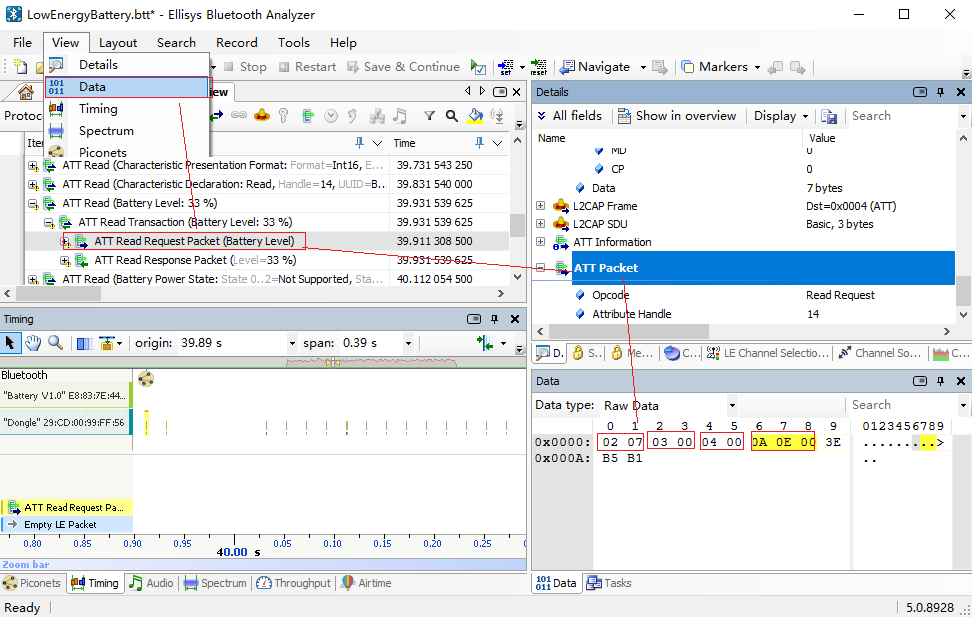

## Ellisys 使用常见问题

### 1. 如何判断空口包的信号质量？如何提高抓包质量？

   - 点击需要查看的空口包，在右侧的Details窗口，Link-Layer Information中，可以看到Sniffer Radio-->RSSI。
   - RSSI在-30dBm~-70dBm应该是比较理想信号强度，这个强度下的空口包不容易出现误包和漏包。
   - Sniffer Radio-->RF Gain即为Record-->Wireless界面下，设置的Bluetooth Radio增益。
   - 根据RSSI空口强度，调节增益，来使抓包器达到最理想的工作信号强度。

### 2. 抓包时，只能抓一小段，抓包设备和软件都在正常运行，但是后面就没有包了，是怎么回事？

   - 可能是抓包软件没有配置抓2M PHY空口包，请参考 开始使用-->抓包配置章节中，Wireless界面配置。
   - 可能是连接过程中，Master设备出现异常，没有继续发包，导致连接异常。观察程序后续有没有连接超时之类的错误上报。
   - 可能是过滤策略导致，尝试将过滤策略取消，看看所有完全的空口包中有没有需要的包。

### 3. 只能抓到经典广播，无法抓到扩展广播，是怎么回事？

   - 请先更新抓包软件Ellisys Bluetooth Analyzer至最新版本。
   - 请参考 开始使用-->抓包配置章节中，Wireless界面配置，勾选Bluetooth 5 Low Energy Advertising Extension。

### 4. 程序运行起来了，可以在抓包器上看到广播包，但是通过手机工具无法扫描到设备，或是发现设备后连接成功概率很低，这是什么问题？

   - 可能是设备的RF信号太弱导致，请将抓包器放置与手机相同位置抓包，观察抓到空口包的RSSI是否处于理想信号强度。信号弱请尝试靠近设备或是检查天线，信号过强请远离设备。
   - 可能是设备时钟不准，导致的RF性能问题，尝试检查设备XO是否有校准。
   - 作为专业抓包器，抓包器RF性能远优于手机RF性能，信号弱或是信号质量差，抓包器大多数情况可以正常抓取。

### 5. 抓包器如何在抓空口包的同时，拉程序中的信号？

   - 找到抓包器Logic 或是 Logic Analyzer接口，连接信号号。另一侧连接设备对应IO口。
   - 参考抓包配置章节，Wired界面-->Logic Transitions and inputs相关说明

### 6. 为什么有的加密的空口包可以解密，有的加密的空口包无法解密？

   - 根据蓝牙协议，使用LE Legacy Pairing方式中的Just Works，并且在初次配对阶段，完整抓取了整个配对过程的数据包，抓包软件才能自动解密。
   - 其他解密包均是要在知道密钥的前提下，才能解密成功。
   - 选择加密空口包，在主界面章节中，Mesh点击View-->Mesh Security，其他空口包点击View-->Security，按照提示填入密钥即可解密。
   - 正确填写Key底色会变成绿色，空口密文包变成明文包。否则为红色，空口内容无变化。

### 7. 抓包软件运行起来非常卡是怎么回事？

   - 抓包软件Ellisys Bluetooth Analyzer更新很快，可能会出现中间版本有bug的情况，尝试更新版本后大概率能解决。
   - 更新方法：点击主界面 Help-->Download offline installer即可下载最新版本

### 8. 抓包软件长时间抓包后，非常卡，而且把我们的系统盘占满了，我应该怎么办？

   - 在未保存之前，抓包软件抓的包，均是通过缓存的方式，存在系统盘中。如果周围蓝牙设备较多，抓包软件可能短时间即抓起大量数据，导致大量占用系统盘空间。这时只要停止抓包，并关闭抓包软件，即可将缓存释放，系统盘空间就会被释放出来。
   - 这里请注意：直接关闭抓包软件，并不会自动保存当前的抓包。
   - 因此长时间抓包之前，为避免单个抓包数据过大，同时也为了避免内存使用过大而导致电脑卡顿，请务必提前设置自动保存抓包文件。
   - 具体设置方法，请参考开始使用-->抓包配置-->Capture Management界面章节内容

### 9. 如何通过空口包查看当前广播周期或是连接周期，以此来对照我们的代码配置符合预期？

   - 打开主界面，点击View-->Timing，打开时序界面。
   - 点击选择Low Energy Overview界面的空口数据包。
   - 在Timing界面，鼠标左键按住左右拉动，即可出现量时序的标识线。
   - 对齐到需要量取的区间即可。
   - 可以右键下拉菜单中，点击Keep，将目前的量测线保留下来，继续量测其他时间区间。
   - 如下示例图，点击选择Low Energy Overview界面的广播空口数据包1，量测出广播周期大约是378ms。点击选择Low Energy Overview界面的连接空口数据包2，量测出连接周期为是20ms。

   

### 10. 我想确定我的广播数据是否设置正确，或是想确定连接数据发出来没有，应该在哪里看发出来的空口数据？

- 在主界面，点击View-->Data，打开Data界面，查看原始数据。
- 选中Low Energy Overview界面想要查看的空口数据包，即可在Data界面看到原始数据。
- 注：加密数据需解密成功后，通过明文数据才能与自己的实际发送的数据比对。揭秘之前默认显示为密文原始数据。
- 广播与连接数据查看方式一致，以下图以查看连接数据为例：
  -	02 07为LL层包头；
  -	03 00为ATT数据长度；
  -	04 00为ATT数据信道；
  -	0A 0E 00为ATT数据；
  -	3E B5 B1为数据CRC校验位。

