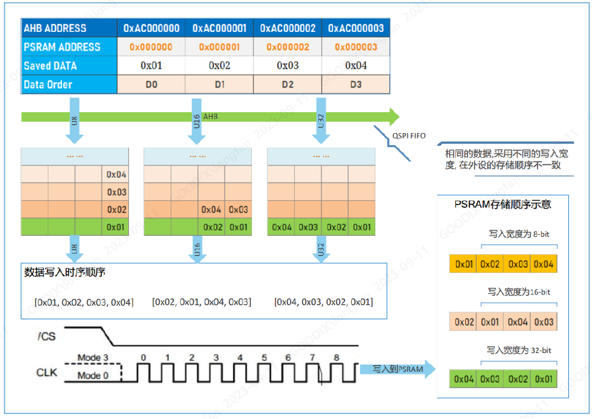
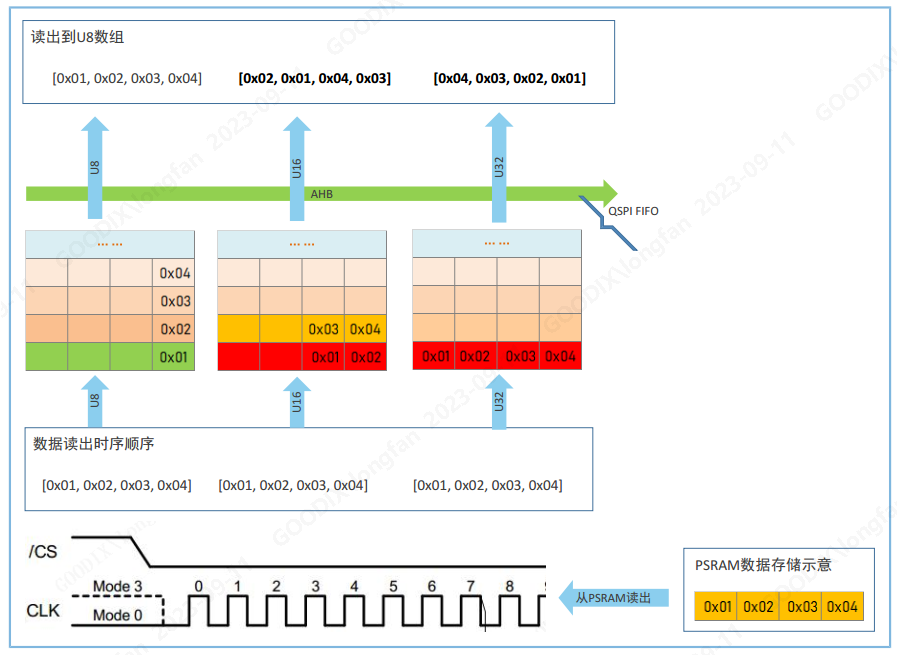

# 03.SPI-QSPI协议专题(3) - GR552x芯片DMA及QSPI模块功能特征

[TOC]

- 前言
  - SPI/QSPI 协议接口是显示类、存储类、以及一些传感器设备的数据通信接口。 
  - 通过这个技术专题, 详细讲解 GR55xx 系列芯片 SPI/QSPI 协议、芯片模块的设计特点、软件接口的用法以及构建高效率的应用接口, 帮助用户快速的理解和发挥 SPI/QSPI 的高吞吐性能。
  - 本文章适用于 GR5525、GR5526。

 

## 1. DMA典型特性

> DMA（Direct Memory Access，直接存储器访问）的通用使用介绍，请参考《GR5526 Datasheet》DMA章节。

### 1.1 DMA 典型应用 

#### 1.1.1 DMA基础数据传输

DMA可用于Memory至Memory、Memory至外设、外设至Memory、外设至外设间的数据传输。 当DMA进行基础的数据传输时， 一次性最大传输4095拍数据。“拍”指DMA传输数据的位宽度。

- 如果使用的数据位宽是字节，DMA单次最多传输数据4095字节
- 如果使用的数据位宽是半字，DMA单次最多传输数据4095*2字节
- 如果使用的数据位宽是字，DMA单次最多传输数据4095*4字节
- 如果DMA一次基础传输时，数据量超过了4095拍，则会给出错误的DMA传输中断提示
- DMA传输地址需要注意地址对齐。

 

#### 1.1.2 DMA链式数据传输

为增强DMA以下场景的传输能力，GR5526 SoC扩展了DMA链式数据传输能力，即可以使用指针链表的方式，将多个数据块进行连接，在一次DMA传输周期内进行传输。

- 突破单次传输4095拍的限制
- 在单次传输周期中传输不连续地址空间的数据
- 在单次传输周期使用不同的传输配置进行数据传输

 

具体的传输形式为：将需要传输的所有数据区块，通过指针链表方式进行管理。上一个区块发送完成后，根据Next链表指针自动对下一个区块进行加载，直到最后Next链表指针为空。

如下图所示，每一个链节点主要包含当前节点的DMA传输配置信息、节点数据块、以及指向下一个链节点的指针信息，直到最后一个传输链节点为NULL。这些链节点会在一次DMA传输中完成，需要每个节点遵守数据量不大于4095拍的规则即可。

DMA链式数据传输可以广泛用在大数据块传输、不连续数据传输、刷屏等应用场景。

> 图1 - DMA链式数据传输

 

#### 1.1.3 DMA分散传输

DMA分散（Scatter）传输指将连续地址空间的数据通过一定的规则，分散到不连续的地址空间的传输。

> 图 2 - DMA分散传输示意图

1. 连续数据被等分为若干数据块，最后一块数据可以不是等分数
2. 每块数据包含的数据数，标记为Count，单位为拍
3. 数据块之间的间隔地址数，标记为Interval，单位为拍

举例：拟使用DMA Scatter传输1000 字节数据，Count为4，Interval 为2

- 如果传输宽度为8-bit，则数据总拍数为      1000拍，每块数据大小为4字节，分散间隔地址为2字节
- 如果传输宽度为16-bit，则数据总拍数为      500拍，每块数据大小为8字节，分散间隔地址为4字节
- 如果传输宽度为32-bit，则数据总拍数为      200拍，每块数据大小为16字节，分散间隔地址为8字节

#### 1.1.4 DMA聚合传输

DMA聚合（Gather）传输指将不连续地址空间的数据，聚合到连续的地址空间的传输。可视作Scatter的逆向传输过程。

> 图3 - DMA聚合传输示意图

 

1. 若干个等长的数据块，按照相同的地址间隔均匀排布（最后一块数据长度可以和前面的不等）
2. 每块数据包含的数据数， 标记为Count，单位为拍
3. 数据块之间的间隔地址数，      标记为Interval，单位为拍

 

举例：拟使用DMA Gather 聚合传输1000 字节数据，Count为4，Interval 为2

- 如果传输宽度为8-bit，则数据总拍数为      1000拍，每块数据大小为4字节，块数据的间隔地址为2字节
- 如果传输宽度为16-bit，则数据总拍数为      500拍，每块数据大小为8字节，块数据的间隔地址为4字节
- 如果传输宽度为32-bit，则数据总拍数为      200拍，每块数据大小为16字节，块数据的间隔地址为8字节

 

#### 1.1.5 DMA同时进行分散/聚合传输

DMA可以同时启用分散（Scatter）/聚合（Gather）传输功能，将不连续地址空间的数据，传输到另一个不连续的地址空间。

 

### 1.2 DMA 传输通道特点

GR5526/GR5525 提供DMA0和DMA1两个可供用户使用的DMA实例，共计6个DMA通道，其中通道0 FIFO深度为32，通道1 ～ 5 的FIFO深度为4。

由于通道0具备很深的FIFO深度，在DMA传输时候能提供极深的数据缓存，从而提高DMA传输吞吐，因此在穿戴类应用中，请优先将DMA0/DMA1的通道0分配给高吞吐外设使用，如用于Flash访问、PSRAM访问、大块Memory搬运、Display显示等。

 

## 2. QSPI典型特性

QSPI的通用介绍，请参考《GR5526 Datasheet》QSPI章节。

 

### 2.1 QSPI工作模式

根据工作时数据线的参与数量和时序行为， GR5526 芯片的QSPI 分为3种工作模式：

- 1-Line      SPI 模式：工作时使用SCLK、CS#、MOSI、MISO信号
- 2-Line      DualSPI 模式：工作时使用 SCLK、CS#、IO0、IO1 信号
- 4-Line      QuadSPI模式：工作时使用 SCLK、CS#、IO0、IO1、IO2、IO3 信号

根据外设访问方式的不同，GR5526 芯片的QSPI分为2种工作模式：

- 寄存器模式（Register      Mode）：在完成QSPI模块及外设的初始化后，QSPI对外设的读写访问通过操作QSPI控制寄存器进行，这些操作在SDK中按照功能封装成函数，而具体的访问行为基于调用具体功能函数（组）的形式进行
- 内存映射模式（Memory      Mapped      Mode）：又称XIP模式，在完成QSPI模块及外设的初始化时，进一步将外设的内存空间映射到系统总线地址空间，通过总线寻址的方式进行外设的访问

一般而言，任何支持QSPI 时序协议的外设，均可以通过寄存器模式进行读写访问，如QSPI 接口的NOR Flash设备、Nand Flash设备、PSRAM设备、Display设备及其他支持QSPI时序的外设。

QSPI NOR Flash、QSPI PSRAM存储设备，除寄存器模式外，还可以通过内存映射模式进行访问。其中，由于不同的访问特征，QSPI NOR Flash只支持通过内存映射模式进行读操作；而QSPI PSRAM 设备可以支持内存映射模式的读和写操作。

 一般支持内存映射访问模式的存储设备，只能在DualSPI/QuadSPI 模式下工作，且为了获得更好的访问效率， 建议尽量工作在QuadSPI模式下。

下表梳理了一般穿戴外设可支持的访问模式，相关建议如下：

- 实际外设的支持情况需要根据具体选用外设的数据手册进行确认
- 只要外设的访问方式支持内存映射访问模式，建议优先采用这种模式，让读取存储设备的程序代码更简洁、访问效率更高效

 

> 表1 - GR5526/GR5525 QSPI对穿戴类外设支持工作模式查询表 

| 工作模式     |         | **NOR Flash** |           | **Nand Flash** |           | **QSPI PSRAM** |           | **Display/LCD** |           |
| ------------ | ------- | ------------- | --------- | -------------- | --------- | -------------- | --------- | --------------- | --------- |
|              |         | **Read**      | **Write** | **Read**       | **Write** | **Read**       | **Write** | **Read**        | **Write** |
| 寄存器模式   | SPI     | Yes           | Yes       | Yes            | Yes       | Yes            | Yes       | Yes             | Yes       |
|              | DualSPI | Yes           | Yes       | Yes            | Yes       | Yes            | Yes       | Yes             | Yes       |
|              | QuadSPI | Yes           | Yes       | Yes            | Yes       | Yes            | Yes       | Yes             | Yes       |
| 内存映射模式 | SPI     | N/A           | N/A       | N/A            | N/A       | N/A            | N/A       | N/A             | N/A       |
|              | DualSPI | Yes           | N/A       | N/A            | N/A       | Yes            | Yes       | N/A             | N/A       |
|              | QuadSPI | Yes           | N/A       | N/A            | N/A       | Yes            | Yes       | N/A             | N/A       |

 

### 2.2 QSPI数据端序

 

#### 2.2.1 写操作下的数据端序

使用CPU或DMA将相同的内存数据，经不同总线访问宽度通过QSPI写入外设时，会得到不同的字节端序，如下图所示。

> 图4 - QSPI 控制器默认写过程演示

 

端序转换过程如下：

1. 将数组{0x01, 0x02, 0x03, 0x04}通过QSPI向外发送。

2. 进入QSPI FIFO队列时：

3. 1. 如使用字节类型写入，则占用4个FIFO深度，0x01,0x02,0x03,0x04依次排列
   2. 如使用半字类型写入，数据在总线上转换为0x0201和0x0403，进入QSPI占用2个FIFO深度，{0x02,0x01}       和 {0x04,0x03} 依次排列
   3. 如使用字类型写入，数据在总线上转换为0x04030201，进入QSPI占用1个FIFO深度，为       {0x04, 0x03, 0x02,0x01}

4. QSPI FIFO采用高字节到低字节的方式向数据线输出数据，则进入数据线的数据：

5. 1. 字节类型写入时，时序线中的数据显示为 0x01,0x02,0x03,0x04
   2. 半字类型写入时，时序线中的数据显示为       0x02,0x01,0x04,0x03
   3. 字类型写入时，时序线中看到的数据显示为       0x04,0x03,0x02,0x01

6. 外设按照不同的数据端序进行存储或处理。

>  说明:  默认情况下，寄存器模式和内存映射模式的数据写入操作均遵守以上端序转换行为。

 

#### 2.2.2 读操作下的数据端序

相对于写入操作，读操作是其逆向过程，针对位于外设地址空间相同的数据，使用不同的读访问宽度，会得到不同字节端序的数据，如下图所示。

> 图5 - 读操作下的数据端序

端序转换过程如下：

- 使用字节宽度，读取外设空间的      {0x01,0x02,0x03,0x04}至内存空间， 结果为 {0x01,0x02,0x03,0x04}
- 使用半字宽度，读取外设空间的      {0x01,0x02,0x03,0x04}至内存空间，结果为 {0x02,0x01,0x04,0x03}
- 使用字宽度，读取外设空间的      {0x01,0x02,0x03,0x04}至内存空间，结果为 {0x04,0x03,0x02,0x01}

默认情况下，寄存器模式和内存映射模式的数据读操作均遵守以上端序转换行为，为了获取相同的字节端序，读写操作的访问宽度需要保持相同。

然而，在穿戴产品应用场景中，图片、字体等资源，由于颜色格式（如RGBA8888、ARGB8888）及色深（RGBA8888、RGB565）的不同，其最小的访问单位可能会是Byte、HalfWord、Word及其组合，因此在软件访问过程中，会涉及到字节端序的处理问题，如果通过软件进行端序调整则会消耗大量的CPU算力。GR5526从IC层设计了支持不同访问场景的端序模式。

 

#### 2.2.3 内存映射模式下静态数据端序读取规则

静态数据端序是根据不同的寄存器配置，输出对应的数据端序（此规则下文简称为静态端序规则）。

- 静态端序规则只适用于QSPI      工作在内存映射模式
- 静态端序规则的应用场景为QSPI      NOR Flash 设备数据的读取

在静态端序规则下，对固定的数据存储顺序，可以通过寄存器配置来实现不同的数据读出端序，下表描述了存储于外设存储设备的数据。

 

> 表 2 - 待读取外设数据

| 外设地址 | 0x000000 | 0x000001 | 0x000002 | 0x000003 |
| -------- | -------- | -------- | -------- | -------- |
| 存储数据 | 0x01     | 0x02     | 0x03     | 0x04     |

 

在外设地址空间0x000000 ～ 0x000003 依次存储了数据0x01、0x02、0x03、0x04。

下表描述了在不同端序规则下，使用不同的数据类型访问上述外设数据时，实际获得的数据。

 

> 表 3 - QSPI读操作的静态端序规则

| 访问类型      | Byte       |            |            |            | Half   Word |            | Word       |
| ------------- | ---------- | ---------- | ---------- | ---------- | ----------- | ---------- | ---------- |
| 访问地址      | 0xAC000000 | 0xAC000001 | 0xAC000002 | 0xAC000003 | 0xAC000000  | 0xAC000002 | 0xAC000000 |
| 端序模式**0** | 0x01       | 0x02       | 0x03       | 0x04       | 0x0102      | 0x0304     | 0x01020304 |
| 端序模式**1** | 0x01       | 0x02       | 0x03       | 0x04       | 0x0201      | 0x0403     | 0x02010403 |
| 端序模式**2** | 0x01       | 0x02       | 0x03       | 0x04       | 0x0201      | 0x0403     | 0x04030201 |

静态端序规则说明如下： 

- 假定外设地址0x000000      ～      0x000003在总线地址空间的映射地址为0xAC000000      ～      0xAC000003。

- 当配置为静态端序模式0时：

- - 使用       Byte （对应C语言的 uint8_t * ）操作访问0xAC000000时，返回为0x01
  - 使用       HALF WORD （对应C语言的 uint16_t * ）操作访问0xAC000000时，返回为0x0102
  - 使用       WORD（对应C语言的 uint32_t *）操作访问0xAC000000时，返回为0x01020304

- 当配置为静态端序模式1时：

- - 使用       Byte （对应C语言的 uint8_t *）操作访问0xAC000000时，返回为0x01
  - 使用       HALF WORD（对应C语言的 uint16_t * ）操作访问0xAC000000时，返回为0x0201
  - 使用       WORD（对应C语言的 uint32_t * ）操作访问0xAC000000时，返回为0x02010403

- 当配置为静态端序模式2时：

- - 使用       Byte（对应C语言的 uint8_t * ）操作访问0xAC000000时，返回为0x01
  - 使用       HALF WORD（对应C语言的 uint16_t *）操作访问0xAC000000时，返回为0x0201
  - 使用       WORD（对应C语言的 uint32_t * ）操作访问0xAC000000时，返回为0x04030201

可根据实际情况，设置合适的端序规则使QSPI在最佳效率下工作。设置静态端序规则的函数：app_qspi_mmap_set_endian_mode。

 

#### 2.2.4 内存映射模式下动态数据端序读取规则

动态数据端序是在内存映射模式下根据不同的数据访问类型，输出相应端序的数据读取规则（此规则下文简称为动态端序规则）。

- 动态端序规则只适用于QSPI      工作在内存映射模式
- 动态端序规则典型的应用场景为QSPI      PSRAM设备数据的读写
- 动态端序规则优先级高于静态端序规则，如果同时启用了动态/静态端序规则，系统只会响应动态端序规则

在动态端序规则下，发生读写访问时，可通过修改数据进入FIFO的行为，自动适应不同数据类型的混合访问。

下图演示了启用动态端序规则后， 执行读写操作时不同数据类型进入QSPI FIFO的行为。动态端序规则帮助保持不同基础数据类型的写入一致性。

> 图 6 - 写操作下不同数据类型进入QSPI FIFO的行为

 

> 图 7 - 读操作下不同数据类型进入QSPI FIFO的行为   

在QSPI PSRAM 设备进行内存映射模式初始化时，GR5526 驱动会自动使能动态端序规则，使PSRAM 的访问行为和SRAM访问行为一致。