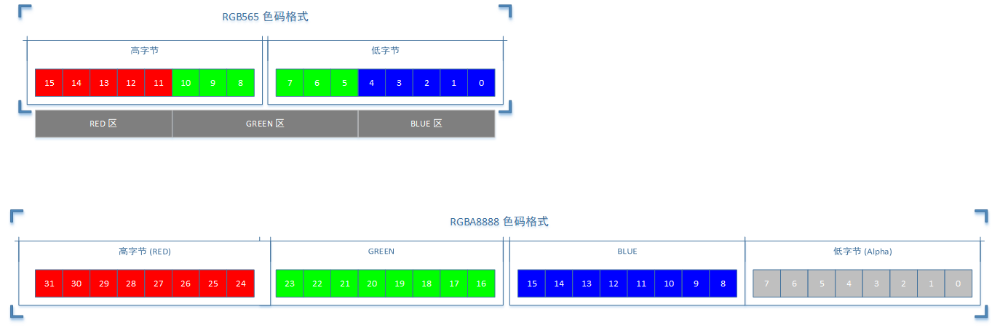
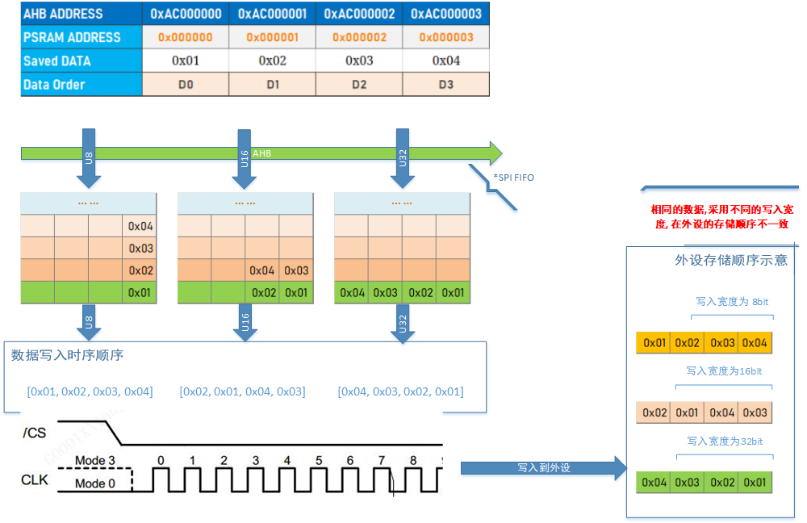
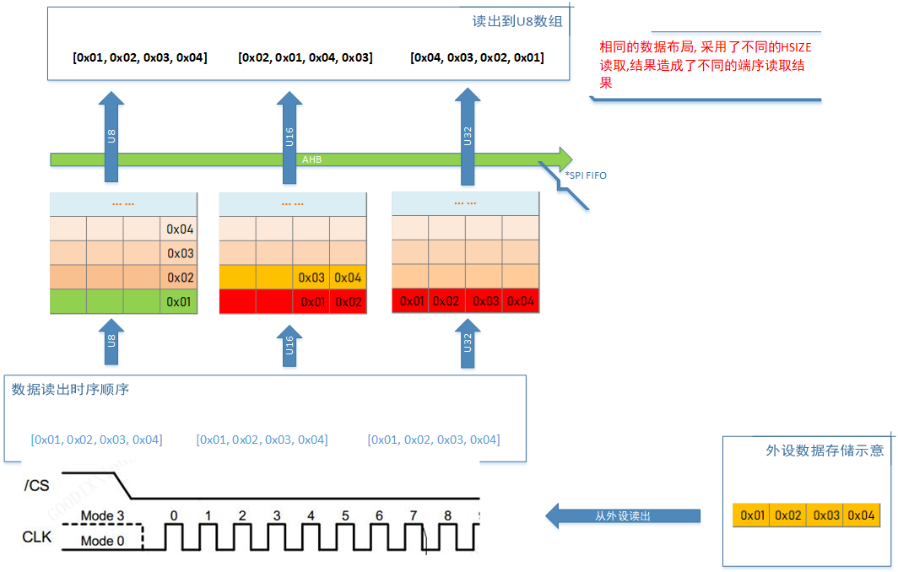
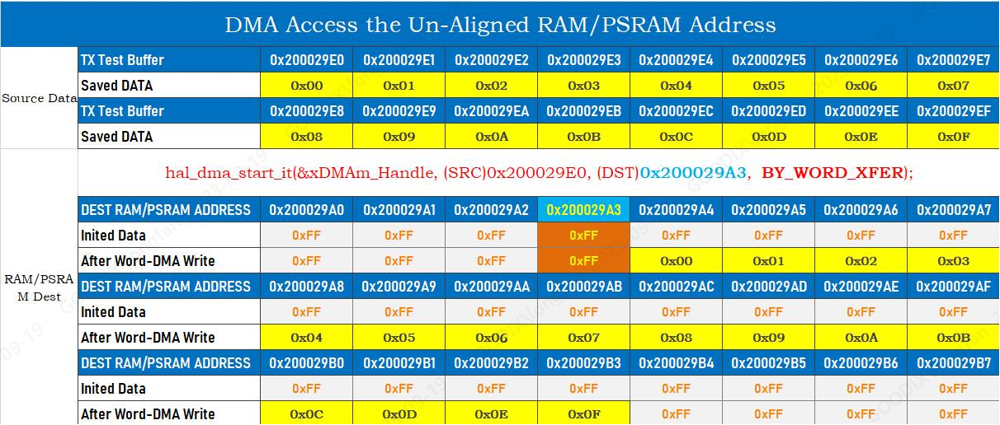
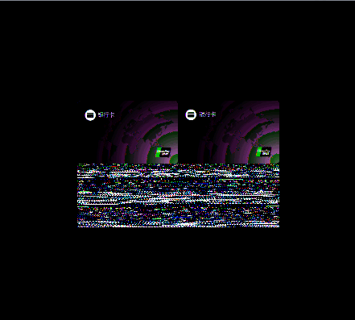
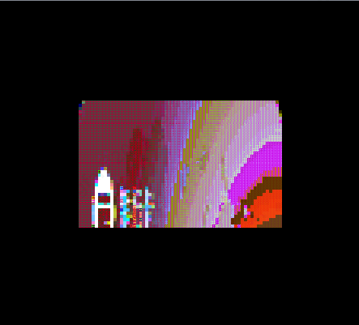

# 04.SPI-QSPI协议专题(4) - 色彩格式及常见异常

[TOC]

- 前言
  - SPI/QSPI 协议接口是显示类、存储类、以及一些传感器设备的数据通信接口。 
  - 通过这个技术专题, 详细讲解 GR55xx 系列芯片 SPI/QSPI 协议、芯片模块的设计特点、软件接口的用法以及构建高效率的应用接口, 帮助用户快速的理解和发挥 SPI/QSPI 的高吞吐性能。
  - 系列文章一般情况适用于 GR551x、GR5525、GR5526； 如果只适用于特定芯片, 会进行标注. 

 

## 1. 屏幕颜色格式

### 1.1 常用的色码格式

当前市场穿戴设备显示屏使用较多的像素颜色格式为 RGB565 和 RGBA8888(或 RGBA8888的变序, 比如ARGB8888等), 分别用 16bit(2字节) 和 32bit (3字节+1字节alpha) 来表征色码值, 可表征的色码值最大为 65536 和 16777216 色. 他们的色码结构分别定义如下:

  

对于 RGBA8888 而言, 由于每个字节单纯的表示一个色域的信息, 在存储和使用过程中, 只有 字节端序的问题需要处理; 而对于 RGB565 格式, 每个字节含有2个色域的信息, 可能会存在字节端序和解析序两类问题.  后文主要用 RGB565 格式为例, 说明在显示过程中可能遇到的问题. RGBA8888 及其他变序格式原理雷同.

 

### 1.2 色码格式的存储及使用

 

当我们用工具将一个图片转换为 RGB565 格式表示后, 在存储、读取及跟其他颜色格式的混合使用过程中, 可能不小心使用的异常的端序, 导致最终显示异常. 我们以几个典型色彩为例, 说明使用中可能存在的异常

 

- 注: 

- - 用 RGB888格式表示的原因是, 方便用绘图软件拾色对比
  - RGB565 色还原为RGB888 色的算法: 
 

 

 

## 2. 可能的乱序原因分析 

### 2.1 外部Flash读写宽度不一致导致的逆序

这个小节适用于:

- GR551x的SPIM及 QSPI 的寄存器类驱动接口用于读写Flash或写屏幕时
- GR5525/GR5526的 SPIM 及QSPI的寄存器类驱动接口用于读写Flash或写屏幕时

 

QSPI 对外设进行访问操作时, 写或者读外部设备的数据序跟使用的数据宽度有关

 

说明:

1. 按照 Byte 宽度写入源数据, 目的数据和源数据的存储位置一致
2. 按照 HalfWord 宽度写入源数据, 目的数据和源数据的存储位置每2字节进行逆序
3. 按照 Word 宽度写入源数据, 目的数据和源数据的存储位置每4字节进行逆序 
4. 对称使用写/读 数据宽度, 可以还原字节序
5. 宽字节序比窄字节序拥有更好的访问带宽, 如果实际使用存在不匹配访问, 可以提前对一端数据序进行逆序处理
6. X-QSPI的Flash由于 Cache的引入, 其访问行为和SRAM一致, 都是小端端序； 不用关注逆序行为

 

 ### 2.2 外部Flash 内存映射读端序配置异常导致的逆序

这个小节适用于:

- GR5525/GR5526 的QSPI接口用内存映射方式访问Flash或者PSRAM设备时候

根据2.1 章节对QSPI写读数据端序行为的描述, 在使用 内存映射模式读取QSPI外部存储设备时（Nor Flash及PSRAM）, 从芯片硬件层面设计了多端序模式: 用户可以通过配置寄存器方式, 将存储好的数据按照特定的端序进行读出. 如下表:

 

在应用开发过程中, 可以根据产品需要, 设计合适的存储及访问模式.

  

### 2.3 DMA 访问由于地址不对齐导致的乱序

在 GR55xx 全系列SoC中, 使用DMA 传输时候, 均要求源/目的地址进行地址对齐：

- 如果按照 Byte 宽度传输, 任意地址都是对齐的
- 如果按照HalfWord 宽度传输, 传输地址需要是偶地址 (__align(2))
- 如果按照Word 宽度传输, 传输地址需要是4字节地址对齐 (__align(4))

 否则会出现由于地址强制对齐转换带来的地址数据传输错位现象. 如下表:

 

计划将 位于 0x2000-29E0地址开始的16字节数据, 搬运到 0x200029A3 地址, 选用的 WORD 传输宽度进行搬运.

由于 DMA 的强制对齐要求, 可以看到, 完成搬运后的地址, 实际是从 0x200029A4 开始存放的, 跟预期的不一样. 就造成了数据位置的错位. 在应用过程中, 需要避免这样的情况. 避免不同宽度区分带来的bug隐患, 建议对需要操作的数据地址, 直接声明为 4字节对齐. 

 

## 3. 常见的显示异常举例 

下列组图展示了图片在正常和各种异常情况下的渲染结果, 可以作为一个参考表. 根据问题反查可能的问题原因.

| RGB565 正常渲染显示                                          | RGB565 像素高低字节交换                                      |
| ------------------------------------------------------------ | ------------------------------------------------------------ |
|  |  |
| 相邻像素两两交换                                             | 图片数据地址没有对齐                                         |
|  |  |
| 将 RGB565格式做RGBA8888渲染                                  | 将 RGB565格式做TSC4渲染                                      |
|  |  |
| 将 RGBA8888格式做RGB565渲染                                  | 将 RGBA8888格式做TSC4渲染                                    |
|  |  |