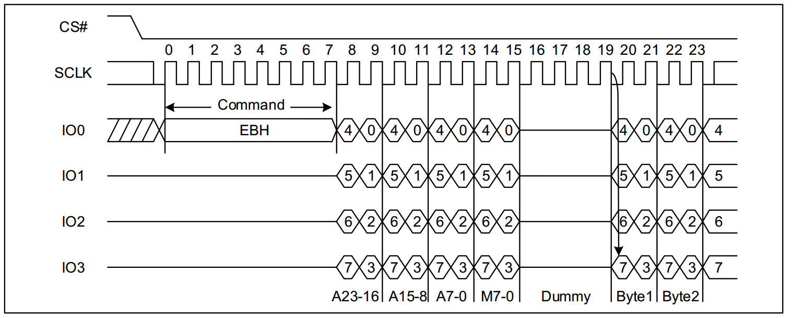

# QSPI使用经验笔记

[TOC]

## 1. 基本功能介绍

-   每个QSPI 模块均可提供 SPI、Dual SPI、Quad SPI 时序模式

-   各芯片的QSPI 模块数量及主要参数

| SoC    | QSPI实例            | 主要参数                                                     |
| ------ | ------------------- | ------------------------------------------------------------ |
| GR551x | QSPI0、QSPI1        | 最高主频32MHz; 挂载APB总线;不支持 Memory Map模式;FIFO深度8x4字节 |
| GR5525 | QSPI0、QSPI1、QSPI2 | 最高主频48MHz; 挂载AHB总线;支持 Memory Map模式; FIFO深度 (16~32)x4字节 |
| GR5526 | QSPI0、QSPI1、QSPI2 | 最高主频48MHz; 挂载AHB总线;支持 Memory Map模式; FIFO深度 (16~32)x4字节 |
| GR533x | 无                  | 略                                                           |

-   GR5525 及 GR5526 扩展了Memory Map能力, 可以将 Nor Flash 及QSPI PSRAM 设备空间映射到总线地址空间访问. 各 QSPI 实例的总线地址空间如下 (总线地址空间和别名空间段是等效的, 最低地址均对应 被映射设备的0地址)

| 芯片   | QSPI 实例 | 内存映射的总线地址空间段 (应用中建议使用) | 别名空间段               |
| ------ | --------- | ----------------------------------------- | ------------------------ |
| GR5526 | QSPI0     | [0xC0000000, 0xC4000000)                  | [0x10000000, 0x14000000) |
|        | QSPI1     | [0xC4000000, 0xC4000000)                  | [0x14000000, 0x18000000) |
|        | QSPI2     | [0xC8000000, 0xCC000000)                  | [0x18000000, 0x1C000000) |
| GR5525 | QSPI0     | [0x10000000, 0x14000000)                  |                          |
|        | QSPI1     | [0x14000000, 0x18000000)                  |                          |
|        | QSPI2     | [0x18000000, 0x1C000000)                  |                          |


## 2. 应用笔记

-   使用Memory Map方式访问 外部Flash时, 请注意使用地址对齐, 非地址对齐的数据, 可能发生错序.

-   芯片涉及QSPI & SPI时序的硬件模块较多, 下面说明帮助用户进行区分:

| 泛SPI时序模块 | 使用场景说明                                                 | 涉及芯片系列                   |
| ------------- | ------------------------------------------------------------ | ------------------------------ |
| XQSPI         | 每款芯片用于支持XIP代码执行的模块,主要用于烧写和执行代码使用, 一般合封在芯片内部,部分芯片有外部连接的封装 | GR551x、GR5525、GR5526、GR533x |
| SPIM          | SPI Master模块, 挂载在APB总线, 支持全双工工作模式. 用于SPI 协议的小尺寸屏幕、传感器等外设驱动 | GR551x、GR5525、GR5526、GR533x |
| SPIS          | SPI Slave模块, 挂载在APB总线, 需要对端作为 Master通讯, 使用场景较少 | GR551x、GR5525、GR5526、GR533x |
| QSPI          | QSPI 硬件模块, 全系芯片的QSPI模块都可以支持配置为SPI、Dual SPI、Quad SPI模式使用,当配置为SPI使用时, 行为和 SPIM 模块相似; GR551x的QSPI模块挂载在APB总线, GR5525、GR5526 的QSPI模块挂载在AHB总线, 其Dual/Quad SPI模式支持 Memory Map访问模式; GR533x 没有QSPI模块. QSPI主要用于驱动Nor/Nand Flash、PSRAM、显示屏等外设器件 | GR551x、GR5525、GR5526         |
| DC            | DC全称为Display Controller, 注意和Direct Current区分. 此硬件模块主要和GPU模块配合, 用于显示屏的驱动控制, 支持产生MIPI DBI Type-C 协议族下的所有时序类型, 包括 SPI、1-SPI、3/4-wire SPI、QSPI等. 此模式只存在于GR5526 | GR5526                         |
| OSPI          | Octual SPI, 只存在于GR5526. OSPI 控制器用于作为 芯片内部 OSPI DDR 接口的PSRAM设备的驱动控制器存在. 其产生的时序为 OSPI DDR时序. | GR5526                         |


-   可通过文章 [SPI/QSPI协议专题(1) - 基础协议特征介绍](https://developers.goodix.com/zh/bbs/blog_detail/49a0f09333f3412380b8a58ce22f879b) 进一步理解 SPI 及泛SPI协议. 
-   注意区分不同应用场景下的QSPI的概念
-   当用于指代硬件模块时, QSPI模块属于芯片的外设
-   当用于表示时序概念时, QSPI 指CS、CLK、D0~D3 构成的时序信号。


-   QSPI 跟DMA的搭配使用原则:
    -   GR551x 下, QSPI0/QSPI1 均可搭配DMA使用
    -   GR5525 & GR5526下
        -   当 QSPI0/QSPI1/QSPI2 工作在 Memory Map模式下时, DMA0/DMA1 均可以用于访问QSPI0/QSPI1/QSPI2的内存空间
        -   当 QSPI0/QSPI1/QSPI2 工作在API接口访问的寄存器模式下时, DMA0可配合QSPI0/QSPI1使用; DMA1可以配合QSPI1/QSPI2使用
        -   当QSPIx和DMA配合用于Flash、屏幕等高吞吐率访问场景下时, 务必使用 DMA的通道0, 通道0设计了最深的FIFO 

-   使用GR5526设计屏幕应用产品时, 请注意, 屏幕接口务必使用 QSPI2 的时序接口, 因为QSPI2硬件模块 和 DC控制器的QSPI时序IO是一致的,这样驱动屏幕时, 既可以使用QSPI2模块,有可以使用DC 模块.
-   GR5525 & GR5526 的Memory Map模式支持最大 512 MByte的寻址空间.
-   GR5525 & GR5526 的Memory Map模式下使用 memcpy 接口, 注意编译时不能使用micro-lib. micro-lib 会严重降低QSPI memory map模式下memcpy的传输效率
-   以下建议对 GR5525 & GR5526 的QSPI模块适用
    -    一般情况在SRAM和工作在内存映射模式下的QSPI设备移动数据时，如果数据量小于1 KB，可优先使
        用 memcpy 函数进行；如果数据量大于1 KB，建议使用DMA进行搬运。数据量越大，DMA会展现越
        大的优势
    -   在内存映射模式下访问数据时，如果需要使用memcpy/memset函数，Keil工程下请优先编译使用系统
        标准库，而不要选用microlib；前者能更好的激活总线Burst传输行为，获得更好的访问效率
    -   部分QSPI设备时序上需要较大的Tcsu(CS Setup Delay Time), 否则不能获得正确稳定的访问数据：
        • 如果设备支持时钟模式3，可尝试设置时钟模式3。时钟模式3会比模式0有更大的Tcsu
        • 可通过寄存器配置增加Tcsu时间
    -    一般QSPI PSRAM 设备需要定时释放片选以完成内部数据保持电路的自刷新，最长的片选时间
        为tCEM，尤其对于写访问，需要严格遵守。
        -   内存映射模式下写访问时，从设计上考虑了tCEM，不用再关注此参数
        -   寄存器模式下，从驱动层考虑了tCEM，但寄存器模式接口复杂度较高。建议QSPI PSRAM设备不在寄存器模式下使用
    -    QSPI 存在预取模式，当进行QSPI读访问时，可以进一步提高 QSPI的读效率，但此模式只能配合DMA工作，不能在CPU访问时开启。
    -   GR5525 & GR5526在设计时对各个QSPI的FIFO进行了差异化优化，一般情况下外设混接QSPI不存在问题；同时，GR5525 & GR5526在设计时也对DMA的FIFO进行了差异化优化，为了发挥GR5525 & GR5526的最佳效率，使用建议如下：
        -   QSPI0优先用于连接Flash设备，可搭配DMA0的通道0工作
        -   QSPI1优先用于连接PSRAM设备，可搭配DMA0/DMA1的通道0工作
        -   QSPI2优先用于连接Display设备，可搭配DMA1的通道0工作
        -   请将DMA0/DMA1的通道0优先留给QSPI0/QSPI1/QSPI2 等高速外设使用，且尽量不同时混用  


## 3. QSPI-FAQ

### 3.1 QSPI支持的最大频率是多少?

-   QSPI 模块支持的最大频率是系统最高频率的二分之一, 支持的分频系数为 2 ~ 65535 之间的偶数, 不支持奇数分频.
-   各款芯片QSPI模块的最大频率支持如下:
    -   GR551x 全系列芯片最高主频为64MHz, QSPI的最大工作频率为 32MHz, 时钟源为系统时钟
    -   GR5525 全系列芯片最高主频为96MHz, QSPI的最大工作频率为 48MHz, 时钟源为外设时钟
    -   GR5526 全系列芯片最高主频为96MHz, QSPI的最大工作频率为 48MHz, 时钟源为外设时钟 
    -   GR533x 全系列芯片最高主频为64MHz, QSPI的最大工作频率为 32MHz, 时钟源为外设时钟


### 3.2 QSPI的工作模式介绍.

-   按照QSPI工作时候需要的数据线划分, QSPI 可配置工作在 SPI 、Dual SPI、Quad SPI模式下；其中 SPI模式和SPI Master模块的工作模式类似
-    QSPI模块下, Dual SPI 和Quad SPI模式又被称为 Enhanced SPI模式. GR5525和GR5526扩展了Enhanced SPI模式的能力. 支持了Memory Map 能力, 支持将挂载到 QSPI接口的 Nor Flash 和 QSPI PSRAM 存储设备映射到系统的总线地址空间, 使用 Memory Map模式进行访问. 而传统的基于API 访问外设的方式, 称作寄存器工作模式.
-   关于 工作模式更详细的介绍, 请参考文档: [GR552x刷屏指南](https://docs.goodix.com/zh/online/detail/display_refresh_guide_bl_b/V1.0/aee091969c2eaa366cb279984812bb42) 


### 3.3 使用Memory Map模式访问访问外部Flash时, 数据端序异常是什么原因? (或图片发生颜色异常)

-   对于GR5525 & GR5526 芯片,  对Memory Map方式增加了灵活端序模式, 允许用户根据自己的需要, 配置数据的读出端序. 这种情况就是期望的数据端序和配置的端序不匹配导致的, 请参考文档 [GR552x刷屏指南](https://docs.goodix.com/zh/online/detail/display_refresh_guide_bl_b/V1.0/aee091969c2eaa366cb279984812bb42)  关于QSPI Memory Map模式下数据端序配置的描述. 在访问数据前, 使用驱动接口 app_qspi_mmap_set_endian_mode 配置期望的数据端序.


### 3.4 使用传统API接口(非Memory Map方式) 读取外部Flash, 数据和期望的数据端序不一致, 请问怎么处理?

-   请参考文档 [GR552x刷屏指南](https://docs.goodix.com/zh/online/detail/display_refresh_guide_bl_b/V1.0/66d6424af28a73c815b87abfa38a20f6)关于读写端序的描述, 应该是数据的写入和读出使用了不匹配的传输宽度导致的逆序. 请尝试调整 DMA 数据传输宽度来修改数据端序行为. 比如
    -   使用 8 bit 传输宽度模式导致2字节的逆序行为, 可以尝试将传输宽度调整为 16 bit (或反之)


### 3.5 如何支持QSPI 模块使用Memory Map模式,访问大于16MB 4字节地址的Flash？

-   app_qspi 驱动预置了flash常用3字节地址(最大寻址范围16MB)的读取指令, 如果用户需要扩展4字节的读取指令. 可参考下述定义进行, 以 GD25Q256E 芯片的 EBH 指令为例:

    

-   时序格式为:

    -   指令 EBH长度1字节, 通过单线模式发送
    -   地址长度4字节, 通过Quad 模式发送
    -   模式位占用 2个 时钟, 但不需要启用. 归为 Dummy 域
    -   Dummy 域4个时钟加模式位占用的2个时钟， 共6个时钟
    -   其他为数据域

-   用户扩展定义指令的方法:

    -   在 app_qspi.h 枚举类型app_qspi_flash_mmap_rd_cmd_e下添加自定义枚举值 **FLASH_MMAP_CMD_4READ_EBH_32** :

        ```c
        typedef enum {
            FLASH_MMAP_CMD_DREAD_3BH         = 0x00,    /**< 3BH in Dual */
            FLASH_MMAP_CMD_2READ_BBH         = 0x01,    /**< BBH in 2Read */
            FLASH_MMAP_CMD_2READ_BBH_SIOO    = 0x02,    /**< BBH in 2Read with SIOO mode */
        
            FLASH_MMAP_CMD_QREAD_6BH         = 0x03,    /**< 6BH in QRead */
            FLASH_MMAP_CMD_4READ_EBH         = 0x04,    /**< EBH in 4Read */
            FLASH_MMAP_CMD_4READ_EBH_SIOO    = 0x05,    /**< EBH in 4Read with SIOO mode */
            FLASH_MMAP_CMD_4READ_EBH_32      = 0x06,    /**< ECH in 4Read with 32 bits address mode */
            FLASH_MMAP_CMD_READ_MAX,
        } app_qspi_flash_mmap_rd_cmd_e;
        
        ```

    -   在 app_qspi.c 文件结构体变量增加指令定义, 注意添加位置和 枚举值的索引值保持一直

        ```
        const qspi_memorymapped_t g_flash_typical_mmap_read_cmd[FLASH_MMAP_CMD_READ_MAX] =
        {
            //…},
            [FLASH_MMAP_CMD_4READ_ECH_32] = {
                .x_endian_mode                  = QSPI_CONCURRENT_XIP_ENDIAN_MODE_0,
                .x_prefetch_en                  = QSPI_CONCURRENT_XIP_PREFETCH_DISABLE,
                .x_continous_xfer_en            = QSPI_CONCURRENT_XIP_CONT_XFER_DISABLE,
                .x_instruction_en               = QSPI_CONCURRENT_XIP_INST_ENABLE,
                .x_instruction_size             = QSPI_CONCURRENT_XIP_INSTSIZE_8BIT,
                .x_address_size                 = QSPI_CONCURRENT_XIP_ADDRSIZE_32BIT,
                .x_inst_addr_transfer_format    = QSPI_CONCURRENT_XIP_INST_IN_SPI_ADDR_IN_SPIFRF,
                .x_mode_bits_en                 = QSPI_CONCURRENT_XIP_MODE_BITS_DISABLE,
                .x_mode_bits_length             = QSPI_CONCURRENT_XIP_MBL_8,
                .x_mode_bits_data               = 0x00,
                .x_dummy_cycles                 = 6,
                .x_continous_xfer_toc           = 0,
                .x_sioo_mode                    = QSPI_CONCURRENT_XIP_INST_SENT_EVERY_ACCESS,
                .x_data_frame_format            = QSPI_CONCURRENT_XIP_FRF_QUAD_SPI,
                .x_instruction                  = 0xEB,
            }
        };
        
        ```

    -   在Flash 的 Memory Map模式初始化时, 读指令引用上述定义的指令进行初始化即可.

    

    ### 3.6 使用SDK的QSPI 示例工程访问Flash失败, 为什么?

    -   注意检查 示例工程的QSPI 实例配置和实际硬件Flash 连接是否匹配
    -   SDK提供的示例工程适配了常见的Flash 驱动, 如果测试的Flash 不是适配的flash型号,请检查flash的datasheet, 是否和参考驱动兼容, 如果不兼容,请自行进行适配
    -   如果硬件环境恶劣, 比如飞线等场景, 尝试降低 Flash 通讯频率
    -   检查下驱动配置的时钟模式是否和Flash 支持的时钟模式匹配
    -   此外, 还可以使用逻辑分析仪抓取访问 Flash 时序信号分析. 
    
    
    
    ### 3.7 QSPI 外设有哪些参考程序?
    
    -   工程  ${SDK}/projects/peripheral/qspi/app_qspi 提供了 app_qspi 驱动访问Nor Flash 的一个应用参考, 可以在SDK 配套的 SK板运行, 用户可以通过这个示例工程, 了解 QSPI APP接口的初步使用.
    -   此外, 针对 GR5525和GR5526, 在 路径 ${SDK}/components/drivers_ext/qspi_device 下提供了如下QSPI外设的驱动参考, 用户可以根据产品的具体情况进行参考和二次开发.
        -   amo139_display_454.c/.h : 基于型号 FLS-AMO139WV334 , 分辨率454x54, 驱动IC  SH8601A 的显示屏开发. 
        -   qspi_flash.c/.h : 兼容 PUYA、XTX等多款市面常用Nor Flash的驱动参考
        -   qspi_nand_flash.c/.h : 基于 Nand Flash DOSILICON.DS35 的驱动参考
        -   qspi_psram.c/.h : 基于 APMemory QSPI 接口的PSRAM 驱动参考
        -   qspi_screen_390.c/.h : 基于鑫世界 RM69330 的显示屏驱动参考, 适配了 390p和454p分辨率
    
    
    
    