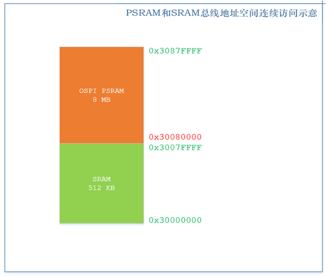
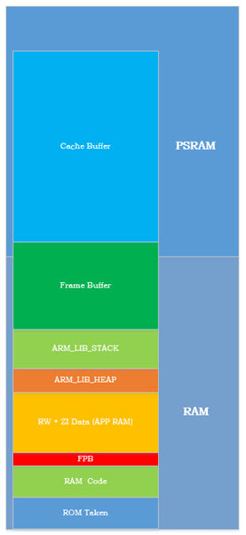

## OSPI PSRAM应用笔记


-   注: OSPI PSRAM是GR5526 SoC系列芯片(存在于 GR5526VGBIP 和 GR5526RGNIP封装)扩展的外设, 其他芯片系列没有OSPI PSRAM


### 1. PSRAM 的总线地址空间布局及管理

-   GR5526中, 512K SRAM其中一组总线地址空间映射范围为【0x30000000, 0x3007FFFF】, 而 64Mbit OSPI PSRAM 的总线地址空间范围映射为 【0x30080000, 0x3087FFFF】. 他们在总线上可用被连续寻址

  

 

-   在实际的应用设计中, SRAM区域会被RAM Code、RW+ZI、系统堆栈、应用层逻辑及算法优先占用, 一般情况下 512KB SRAM 不会占用完, 剩余的 SRAM 和 PSRAM     一并构成一个大块的Heap区域. 用户可用来做显示存储或数据存储等. 典型的内部分布结构如下:

 

 

-   为了在应用工程方便管理 上述内部布局, 请在使用     PSRAM版本SoC的应用工程, 采用专门的scatter布局文件 (Keil 版本:     ${SDK}\platform\soc\linker\keil\flash_scatter_graphics.sct)
-   为方便管理剩余 SRAM及 PSRAM组成的大块数据空间,     SDK 提供了专用的 Heap管理驱动文件app_graphics_mem.c & app_graphics_mem.h。

-   堆管理文件位于: ${SDK}\components\libraries\app_graphics_mem, 将数据区域的基地址和数据块大小注册&初始化后, 即可使用app_graphics_mem_malloc 和 app_graphics_mem_free 进行数据块的申请和释放使用.

-   此堆管理驱动的堆节点和数据块实现了分离, 堆接点始终存放在     SRAM 区域, 可实现休眠下的Retention。

 

### 2. PSRAM 的初始化和使用

-   PSRAM 的初始化很简单, 调用如下代码即可. 接口会同时将 OSPI 模块和PSRAM设备初始化到工作状态

    ```
    app_graphics_ospi_params_t params = PSRAM_INIT_PARAMS_Default;
    app_graphics_ospi_init(&params);  
    ```


-   确保编译器引用的分散加载文件为: ${SDK}\platform\soc\linker\keil\flash_scatter_graphics.sct

-   调用如下代码, 将 剩余SRAM 和     PSRAM组成的区域, 注册到Heap 管理器. 

    ```c
    mem_pwr_mgmt_mode_set(MEM_POWER_FULL_MODE);
    app_graphics_mem_init((void*)GFX_MEM_BASE, GFX_MEM_SIZE);  
    ```

-   接下来, 就可以用app_graphics_mem_malloc 和 app_graphics_mem_free 接口使用这片堆区域了


### 3. PSRAM 的工作模式

 

OSPI PSRAM 设计了2种工作模式: ACTIVE、Deep-Sleep

-   Active 模式: PSRAM 在 Active     模式随时可以被访问, 数据会一直保持住. 当 PSRAM 正被访问时, 根据访问强度, 功耗约为 2 ~ 5mA级别; 当PSRAM 在     ACtive 下保持待机模式(StandBy), 功耗约为 66uA @ 20℃. 

-   Deep-Sleep模式:     当系统休眠且不需要保持数据时候, 可以将 PSRAM 设备设置为Deep_Sleep模式, 在Deep_Sleep模式下, PSRAM设备会被断电, 工作电流接近 0uA.

PSRAM驱动提供了工作模式切换接口, 允许用户根据应用需要, 切换PSRAM 的工作模式. 目前支持的模式为 Active 和 Deep-Sleep 模式

 

### 4. PSRAM 的休眠策略

由于系统休眠框架的设计, PSRAM设备在裸机环境下和OS环境下的休眠策略存在一些差异.

-   裸机模式下, 系统休眠由用户负责管理

-   OS 模式下, 以FreeRTOS为例, 会在 OS 的移植层设计系统的休眠策略.

上述差异导致两种环境下的 PSRAM 模式使用存在一些差异.


#### 4.1 裸机环境下的休眠策略


 

-   系统初始化时, 将 OSPI PSRAM 初始化到工作状态

-   如果初始化完成后, 短期不会使用 PSRAM, 可以调用接口将PSRAM 设置为 Deep-Sleep

-   系统休眠前, 会调用模块的配置保存接口,将模块的寄存器配置保存到Retention SRAM区域 ：但驱动上没有提供 OSPI模块的寄存器保持接口

-   系统休眠, 由于没有提供 OSPI 模块的寄存器保持,在休眠期间, OSPI 模块配置会丢失

-   系统唤醒时, 会调用模块的配置恢复接口,将模块在休眠前保存到Retention SRAM区域的配置恢复到寄存器 : 驱动上没有设计寄存器恢复接口, 因此这里调用 OSPI 配置接口将OSPI 重新配置一次 (实测时间几us, 可以接受)

    如上, 可以看到, 在裸机环境下, 系统休眠策略集成了 对 OSPI 模块的管理, 但没有集成 对PSRAM 状态的管理. 因为PSRAM 由于功耗很大, 休眠/唤醒耗时也比较长, 需要跟应用层的业务逻辑强相关设计。

 

对于应用层而言. 

1.  在系统初始化时,调用初始化接口
2.  在PSRAM 可以掉电休眠时候, 调用app_graphics_ospi_set_power_state(OSPI_STATE_DEEP_SLEEP) 使PSRAM休眠掉电
3.  在PSRAM 需要重新工作时, 调用app_graphics_ospi_set_power_state(OSPI_STATE_ACTIVE) 使PSRAM状态恢复
4.  如果某个阶段需要PSRAM保持数据, 在 设置 ACTIVE后, 不调用休眠接口即可. 但此期间会付出额外的功耗.


#### 4.2 RTOS环境下休眠策略

可参考 FreeRTOS 工程, 系统已集成 OS环境下的PSRAM 状态管理.

