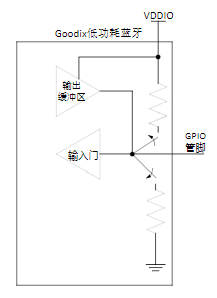

# I/O应用笔记 #

## 1. I/O 基本功能介绍

- GR5xx的I/O系统分别有GPIO、AON IO和MSIO三种。其中GPIO是属于MCU域，系统睡眠时不能产生中断、只能维持睡眠前的电平状态; AON IO是属于always on电源域，系统睡眠时能够产生中断和唤醒系统；MSIO是既能传递数字信号也能传递模拟信号的IO.

- 关于IO的供电域，GPIO0~GPIO15是由VDDIO_1供电；其他GPIO以及所有的AON IO是由VDDIO_0供电；MSIO是由VBATL供电。它们作为输出时高电平的电压、作为输入时的最大输入电平电压，都是由他们供电域的电压决定。

- 关于IO的中断：MSIO没有中断功能；其他IO都有中断功能，中断触发方式可以配为高电平触发、低电平触发、上升沿触发、下降沿触发和双边沿触发(GR51xx没有双边沿触发功能)。

- IO支持MUX为其他外设功能的IO。GR533x的每个IO都能单独MUX为所有外设范围中的某一种；除GR533x外的其他芯片，每个IO只能MUX为该IO特定几种外设范围中的某一种。具体的详见datasheet关于 Pin mux章节的描述，里面有一个 Pin mux table，详细列举了每个IO 与其他外设的mux对应关系。

- IO默认状态：MSIO上电默认是模拟属性IO；其他IO上电默认状态是输入、下拉。

- IO的驱动能力：GR551x在2.5mA左右，GR552x在5mA左右，GR533x在12mA左右，具体见datasheet关于IO章节的electrical specifications 部分。

- IO内部有上下拉电阻可以配置，分别可以配置为使能上拉、使能下拉、上下拉均不使能。注意不能同时使能上下拉电阻，否则IO会漏电。IO内部的结构框图如下图，其中单个电阻的阻值在各个芯片型号中有差异，具体参见datasheet关于IO章节electrical specifications 部分的描述：

  
  
  
## 2. I/O 应用笔记

- 如何配置和使用IO

  - 分别设置好IO入参的pin(引脚号)、mode(输入/输出/中断/模拟)、pull(上下拉选择)、mux(选择作为IO功能的mux)这四个参数，然后调用app_io_init（）进行初始化（第一个入参是IO的类型，第二个入参是上面配置的结构体参数）。
  
  - 输出：调用app_io_write_pin（）进行IO的高电平和低电平设置，也可以调用app_io_toggle_pin() 进行IO电平的翻转。注意，如果要快速设置IO的电平，也可以调用LL层的接口(在各种类型IO的ll层头文件里)，如ll_gpio_set_output_pin（GPIO0, LL_GPIO_PIN_4）。
  
  - 输入：调用app_io_read_pin（）获取IO的电平。
  
- 如何配置中断IO和作为唤醒源
  - 配置中断IO时，上面参数的mode要设置为带_IT的模式，并选择合适的中断触发方式，如io_init.mode = APP_IO_MODE_IT_FALLING; 表示设置下降沿触发的中断。
  - 配置中断IO时，需要调用app_io_event_register_cb（）进行中断IO的初始化，以及中断回调函数的设置。
  - 如果需要同时配置好几个中断IO，设置好参数后，也可以调用app_gpiote_init（）统一进行初始化。
  - 几个IO可以指向同一个中断回调函数。然后在中断回调函数里，根据p_evt->type和p_evt->pin来判断是否为想要的IO响应的中断。
  - 对于IO作为唤醒源，配置了AON IO的中断，也就具有唤醒的功能。GPIO没有唤醒功能；MSIO既没有中断功能，也没有唤醒功能。

​    以上介绍的功能使用，具体代码可以参考SDK\projects\peripheral\gpio\app_gpio这个事例工程。

- 上下拉电阻的配置原则
  
  - GPIO管脚设为输出时，则应禁能内部上/下拉电阻。
  
  - GPIO管脚作为输入且连接的外部设备处于高阻抗状态，则应使能内部上拉或下拉电阻（注意：不能同时使能上拉和下拉）。
  
  - GPIO管脚设为输入且该管脚被外部设备拉高/低时，则应禁能内部上/下拉电阻。
  
  - GPIO管脚未使用，则使能内部下拉电阻。
  
  - GPIO管脚处于浮空状态，当引脚上有外部干扰电压时，GPIO管脚则应使能内部上/下拉电阻。
  
- 如何设置IO高电平的电压
  - IO高电平的电压是由VDDIO_0或VDDIO_1的电压决定（具体的IO是受控于VDDIO_0还是VDDIO_1， 上面基本功能介绍里面有讲到）。
  - 有些芯片型号会把VDDIO_0或VDDIO_1引出来，用户可以把外部电路LDO出来的电压（比如3.3V或1.8V）接到VDDIO_0/VDDIO_1上，来决定该域管控的IO的高电平电压是3.3V还是1.8V。
  - 用户也可以把VDDIO_0/VDDIO_1接到芯片的IO_LDO_OUT引脚，这样该域管控的IO高电平电压就由内部的IO_LDO的电压决定。
  - 有些芯片品型号的VDDIO_0或VDDIO_1没有引出来，对于没有引出来的VDDIO，那么其在芯片内部已经跟IO_LDO绑定在一起了，所以该域管控的IO高电平电压也是由内部的IO_LDO的电压决定。
  
- 使用MSIO时的注意点
  - MSIO默认是模拟口，模拟口在没有信号输入时是高组态。
  - MSIO是给ADC或比较器传递模拟信号的，所以其内部是通过门电路开关与ADC和比较器进行连接。此时要注意，MSIO上的电压不能超过VBATL！过高的电压容易把门电路冲击破坏，从而可能会损坏ADC或比较器模块。
  - MSIO没有中断功能。
  - MSIO作为数字高速IO时(比如mux为SPI)，建议提升MSIO的驱动电流，调用app_io_set_strength()进行驱动电流的设置。

