# 01.SPI-QSPI协议专题(1) - 基础协议特征介绍

> 前言

- SPI/QSPI 协议接口是显示类、存储类、以及一些传感器设备的数据通信接口。 
- 通过这个技术专题, 详细讲解 GR55xx 系列芯片 SPI/QSPI 协议、芯片模块的设计特点、软件接口的用法以及构建高效率的应用接口, 帮助用户快速的理解和发挥 SPI/QSPI 的高吞吐性能。
- 系列文章一般情况适用于 GR551x、GR5525、GR5526； 如果只适用于特定芯片, 会进行标注. 

## 1. SPI协议

SPI是一种同步串行接口技术,是一种高速、全双工、同步通信总线,在芯片中只占用四根管脚用来控制及数据传输,广泛用于EEPROM、Flash、RTC（实时时钟）、ADC（数模转换器）、DSP（数字信号处理器）以及数字信号解码器上
	
### 1.1 引脚信号

SPI 协议定义了4根功能信号引脚:
	
- SCK(Serial Clock)：SCK是串行时钟线,作用是Master向Slave传输时钟信号
- MOSI(Master Out Slave in)：在SPI Master上也被称为Tx-channel,作用是SPI主机给SPI从机发送数据
- CS/SS(Chip Select/Slave Select)：作用是SPI Master选择与哪一个SPI Slave通信,低电平表示从机被选中(低电平有效)
- MISO(Master In Slave Out)：在SPI Master上也被称为Rx-channel,作用是SPI主机接收SPI从机传输过来的数据

### 1.2 角色

SPI 协议中， 存在Master 和 Slave两类角色, 通信采用主从控制方式进行, 传输由Master 负责发起； Slave负责应答. 主从通信的典型的通信拓扑如下图:
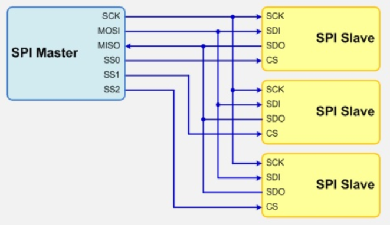

- SPI协议规定Slave设备的clock由Master通过SCK管脚提供给Slave，Slave本身不能产生或控制clock，没有clock则Slave不能正常工作
- SPI总线在传输数据的同时也传输了时钟信号，所以SPI协议是一种同步（Synchronous）传输协议。Master会根据将要交换的数据产生相应的时钟脉冲，组成时钟信号，时钟信号通过时钟极性(CPOL)和时钟相位(CPHA)控制两个SPI设备何时交换数据以及何时对接收数据进行采样，保证数据在两个设备之间是同步传输的
- SPI总线协议是一种支持全双工的串行通信协议，数据传输时高位在前，低位在后

### 1.3 时钟频率

SPI 协议是一种由时钟信号驱动的协议, 当时钟频率固定时候, 起工作效率也被固定. 一般情况下, SPI Clock有系统的主频时钟或者外设时钟分频而来. Master / Slave 可能获取的最大工作频率并不相同

下表为 GR55xx 系列芯片SPI/QSPI 时钟频率表

### 1.4 时钟模式

SPI协议定义了4种时钟模式，这4种模式分别由时钟极性(CPOL，Clock Polarity)和时钟相位(CPHA，Clock Phase)来组合而成.

- CPOL参数规定了SCK时钟信号空闲状态的电平
- CPHA规定了数据是在SCK时钟的上升沿被采样还是下降沿被采样 (第一个或第二个突变边沿采样)

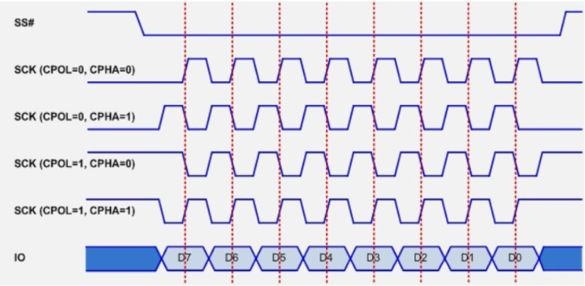
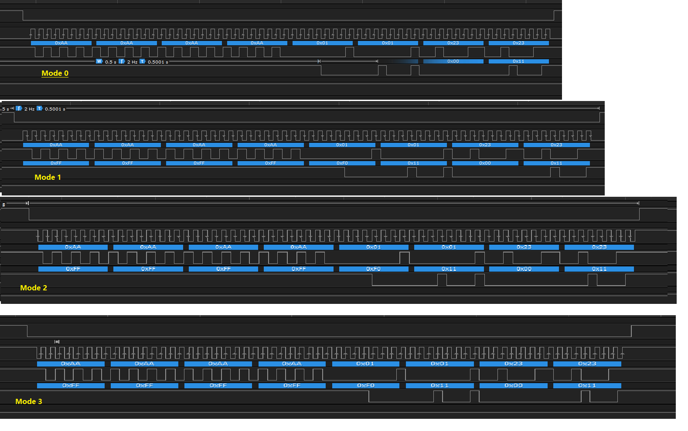

### 1.5 时序相位

SPI协议完整的时序构成为 : 指令 、地址、数据。而在一个功能化的时序中, 可以只包含其中的某些部分(地址不能独立存在)

- 典型的读操作时序
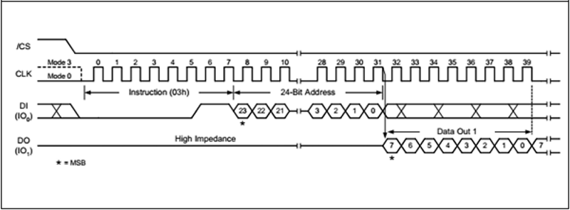
- 典型的写操作时序
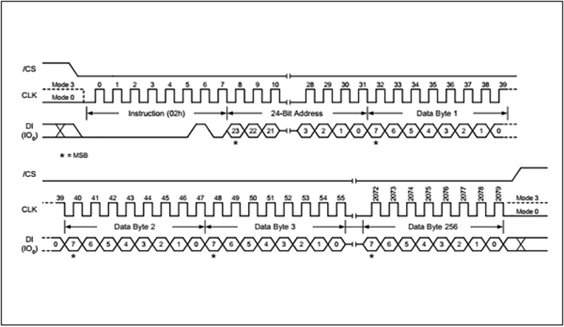

### 1.6 SPI 协议衍生时序

在SPI协议的基础上, 进行 数据I/O 或其他功能线的扩展, 衍生出众多的SPI 族时序.

## 2.QSPI 协议

### 2.1 概述

QSPI (QuadSPI)时序协议, 以及DSPI(Dual SPI), 基于SPI进行了扩展. 但CSn、Clock功能以及时钟模式、时钟频率等与时序协议与SPI 类似. 依然是同步、串行协议. 但其工作模式发生了些变化.   在DSPI/QSPI 模式下, 数据线不再是全双工模式

### 2.2 引脚信号

QSPI  -  Quad SPI协议, 数据线由 SPI 的 MOSI、MISO扩展为 IO0、IO1、IO2、IO3.  

典型的电路接线图:
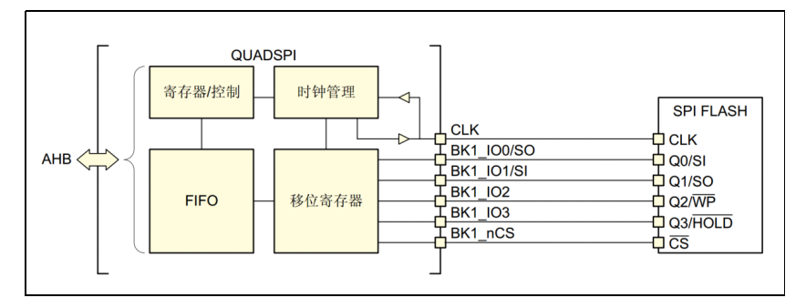
常见的Flash 设备同时支持 SPI, Dual SPI, Quad SPI 工作模式, 再不同模式下, IO 具备不同能力. 

### 2.3 时序相位

标准的QSPI 时序由5个如下相位部分构成

- 指令 : 进行控制行为的定义及识别
- 地址 : 拟操作的目标地址
- Mode Bits : 模式位, 一般只存在 Nor Flash 设备中, 用于标注 是否支持SIOO 模式 
- Dummy Cycles : 等于Wait Cycles, 等待周期, 给予从设备的数据输出等待时间
- DATA : 数据

### 2.4 指令地址模式

在QSPI 时序中, 指令地址存在如下几种发送方式:
(注: 下面时序截图参考源自市面QSPI接口 Flash (PUYA)/PSRAM设备的Datasheet)

- 指令单线, 地址单线发送模式.  
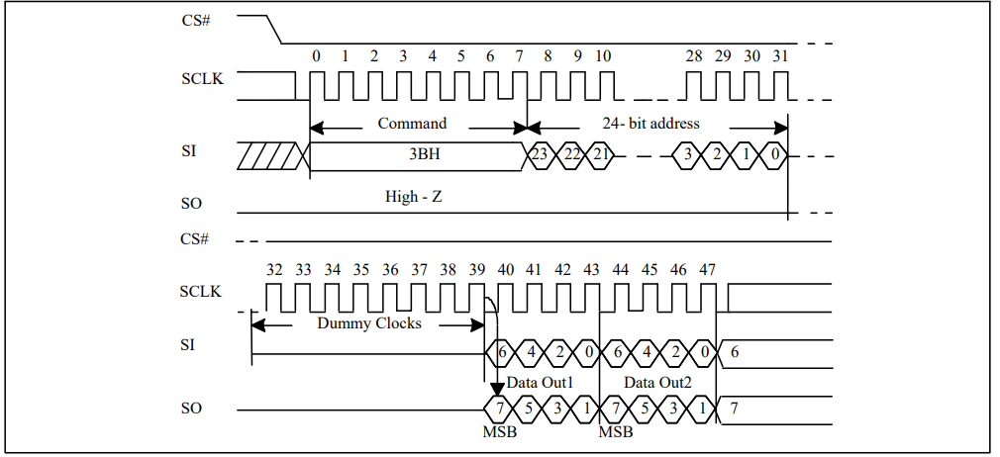

- 指令单线, 地址多线发送模式.
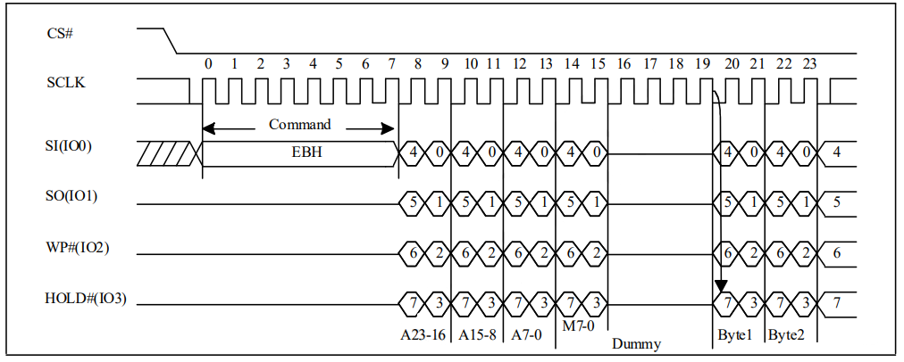

- 指令多线, 地址多线发送模式.
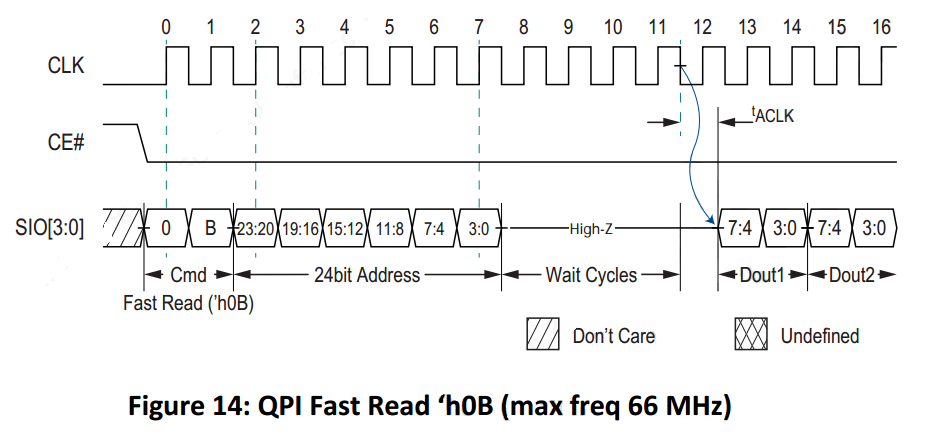

当地址通过多线发送时候, 后续相位也一定使用多线模式进行发送

### 2.5 QPI 模式

在QSPI 模式下, 当所有有效的相位均通过Quad 模式发送时, 将其称为 QPI 模式, QPI模式多见 QSPI PSRAM 设备.
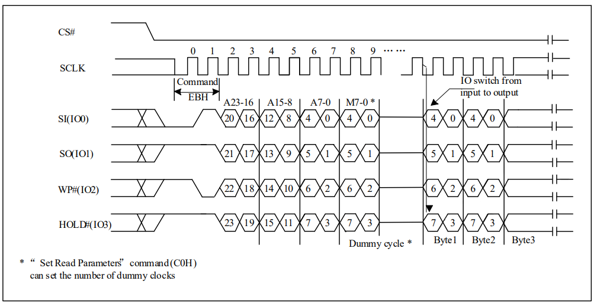

### 2.6 SIOO 模式

SIOO模式, Sent Instruction Only Once 模式.

常见于Nor Flash 的读命令, 需要Mode Bits 相位支持, 声明此模式后, 只需要在第一次访问时候, 在时序中包含 命令相位部分, 在后续的时序中, 不用再发送.直到 Mode Bits 状态发生变化
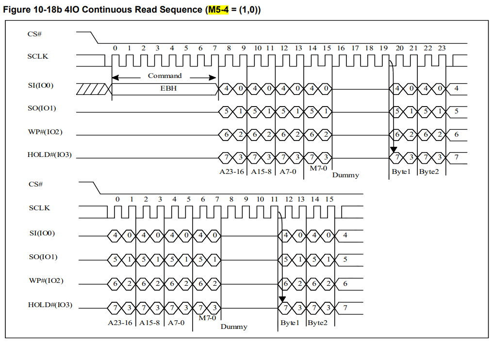

### 2.7 效率计算

DATA Phase 以外的Phase 都算作Overhead. 

每次访问效率 = DATA Clock / Total Clock

