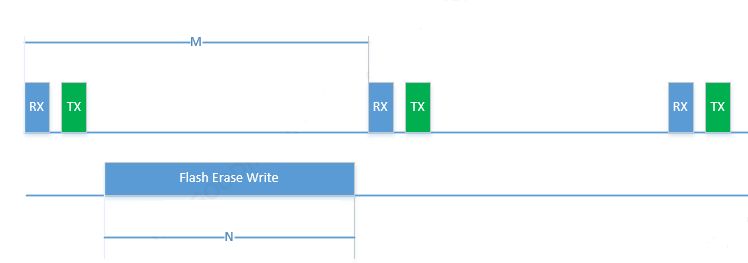

## BLE 与执行代码Flash 冲突处理

-	在GR5XX系列芯片中，BLE 任务在最高优先级中断中执行调度。可以存在打断但是大段时间不易过长。然而片上Flash 操作必须关闭中断。因此在操作Flash和BLE调度同时发生时，必然出现冲突。

### 1. 如何避免BLE 与Flash之间的操作冲突
- Flash 以Page为基础单位，每256Byte 为1 Page。每4096Byte为1 Sector。其中Read操作没有长度限制。Write 以1 Page为基础单位，Erase以1Sector为计出单位。且由于Flash特性，只能由1写为0。因此同一个 Page需要重新写入，必须擦除整片Sector。

  Read 1Sector  143.63us ; Write 1Sector  26.47ms,Erase 1Sector 17.25ms。

  Read 2Sector  282.88us ; Write 2Sector  53.09ms,Erase 1Sector 34.30ms。
  
  根据读写擦长度，按照线性增长。
  
  正常Android 刚连接上BLE时刻的连接参数为 45ms Interval,5s Timeout。在此参数下，如需一次擦写40K Flash,只需在每个Sector操作之间做45ms delay，来释放中断让BLE调度即可。即每次有一个连接间隔会因操作Flash 关中断错过。如此操作40K，在保证蓝牙稳定链接的情况下需要900ms 。
  
  按照正常iOS 刚连接上BLE时刻的连接参数为30ms Interval。在此参数下，如需一次擦写40K Flash,只需在每个Sector操作之间做30ms delay，来释放中断让BLE调度即可。即每次有一个连接间隔会因操作Flash 关中断错过。如此操作40K，在保证蓝牙稳定链接的情况下需要750ms。
  
  那什么时候需要每个Sector Delay，什么时候不需要呢？
  
  假设操作一次Flash的时间为N ms ,连接间隔为M ms ，timeout为 T ms:
  
  a. 当M > N时 ，操作Flash 完全不需要 delay 。即操作一次Flash 需要95ms,连接间隔为100ms ，那么完全不用做Delay.
  
   
  
  b. 当T < N时 ，操作Flash的时间比Timeout的时间还要长，则推荐每操作一个Sector Delay 一次 M ms。
  
   
  
  c. 当M*6 < N 时，操作Flash时刻正好是建连时刻，从设备收到连接请求后6个interval内必须有回复。则推荐每操作一个Sector Delay 一次 M ms。
  
   
  
  d. 当M < N <(5*M) 且 （5*M <T ）时，操作Flash时间可以保证建连时序，任然是无需Delay 。
  
   
  
  最后推荐操作Flash的时刻需有如下注意点：
  
  1. 请避开蓝牙刚连接的时间，因为刚连接上TimeOut时间短，例如iOS只有720ms ，即避开情况C。
  2. 请在蓝牙稳定后操作，例如前期发现服务等操作完成后进入维持链接状态，即情况A时刻操作Flash。
  3. 如果业务无法在A场景下操作，请每操作1Sector，进行一次1个Interval的 Delay。以保证蓝牙稳定性。
  
  

