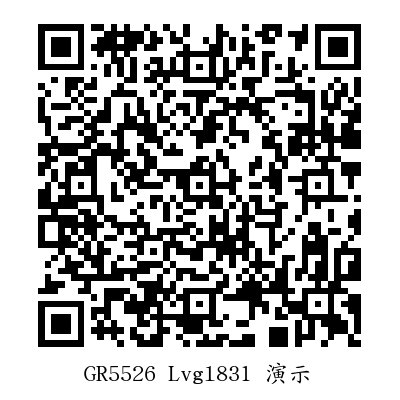
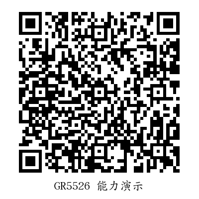
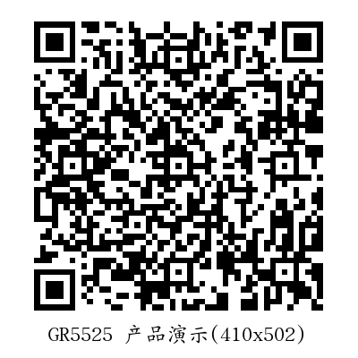

# 02_穿戴(手表)参考方案使用说明

## 1. GR5526 穿戴(手表)参考方案

-   请从 [开发向导] 页面获取GR5526 SDK的下载地址下载 SDK, 并在本地构建好开发环境

-   请从 [开发向导] 页面获取GR5526 各种文档资料的下载地址, 在进入产品开发前, 花一些时间熟悉和阅读芯片相关的开发资料, 是必要的.

-   请从  [开发向导] 页面获取GR5526 开发过程所需要的软件和工具, 方便你的开发和调试工作.

    

### 1.1 示例工程

GR5526 SDK 提供了丰富的参考示例工程, 涵盖BLE (Profile、多连接、DTM)、外设使用、OS、DFU、低功耗、产品参考设计等. 

针对穿戴产品, 列举了部分重要的示例工程； 用户参考以下示例工程, 可以从零开始构建一个穿戴产品的各个软件模块, 从外设驱动到OS、到应用逻辑、到BLE Profile、到DFU/OTA、到休眠调试等.  

| 工程                 | 路径                                                         | 描述                                                         |
| -------------------- | ------------------------------------------------------------ | ------------------------------------------------------------ |
| FreeRTOS模板工程     | ${SDK}\projects\ble\ble_peripheral\ble_app_template_freertos | 移植的FreeRTOS基础工程, 支持休眠低功耗, 可以基于此工程理解休眠设计和从0构建应用工程 |
| DTM测试工程          | ${SDK}\projects\ble\dtm\direct_test_mode                     | 基于此工程进行BLE的DTM测试                                   |
| Lvgl 810穿戴参考工程 | ${SDK}\projects\peripheral\graphics\graphics_lvgl_810_gpu_demo | 基于Lvgl 810开发的穿戴参考, 集成了常用的外设模块, 构建了基础的UI/UX. 可作为用户设计参考 |
| Lvgl 831穿戴参考工程 | ${SDK}\projects\peripheral\graphics\graphics_lvgl_831_gpu_demo | 基于Lvgl 831开发的穿戴参考, 集成了常用的外设模块,集成了BLE Profiles和DFU,构建了基础的UI/UX. 可作为用户设计参考 |
| 产品升级引导参考工程 | ${SDK}\projects\ble\dfu\app_bootloader                       | 提供的boot loader引导固件, 可用于产品 DFU升级引导程序        |
| DFU OTA 升级参考工程 | ${SDK}\projects\ble\ble_peripheral\ble_app_template_dfu      | 集成OTA功能,配合 app_bootloader 和 OTA App(GRToolBox)使用, 产品开发过程中,需要将本工程的OTA  部分移植到产品工程中. |

-   如果能获取或购买到 GR5526 SK板, 可以在SK 板上先行运行体验上述工程. 对程序和效果的直观的测试体验能帮助工程师快速建立产品和SDK的使用直觉.
-   如果用户具备丰富的穿戴产品开发经验, 上述工程作为产品开发中的调试参考; 
-   如果用户相对缺少穿戴产品的开发经验, 可考虑使用 Lvgl 831(或810) 工程作为模板工程, 在上面删减不需要的功能, 并开发集成产品业务缺失的功能.
-   此外, 我们提供了部分参考工程的视频演示, 你可以扫描下发二维码进行查看和体验

| GR5526 Lvgl 831 演示视频                            | GR5526 能力演示视频                               |
| --------------------------------------------------- | ------------------------------------------------- |
|  |  |

### 1.2 驱动参考

GR5526 SDK 提供了常用芯片外设和外设模块的驱动参考程序, 在产品开发中, 根据实际情况, 可以进行参考或者复用. 

| 外设模块                         | 驱动文件或目录                                               | 使用说明                                                     |
| -------------------------------- | ------------------------------------------------------------ | ------------------------------------------------------------ |
| GPU                              | ${SDK}\app\drivers\src\app_graphics_gpu.c                    | 主要管理 GPU 模块的初始化、休眠和同步等, GPU 的 接口. 只用于GPU 版本芯片 |
| GPU 驱动接口                     | ${SDK}\app\components\graphics\gfx                           | GPU 的驱动接口头文件放置                                     |
| Display Controller(显示控制模块) | ${SDK}\app\drivers\src\app_graphics_dc.c                     | DC 模块可用于产生 SPI、3-SPI、4-SPI及QSPI的屏幕控制时序, 以及处理 GPU专用的压缩各种, 只用于GPU  版本芯片。 |
| OSPI PSRAM                       | ${SDK}\app\drivers\src\app_graphics_ospi.c                   | OSPI 是接口类型 Octal-SPI, PSRAM 是通过OSPI DDR接口扩展的可读写 RAM空间, 速度比内部SRAM  慢一些. 但比外部的QSPI PSRAM 快很多; 尽可能用 DMA、GPU master 大数据块方式访问 PSRAM, 尽可能避免使用CPU  指针访问大空间的PSRAM, 会降低访问性能; PSRAM 地址空间和SRAM 的一块别名地址空间连续 |
| PSRAM 堆管理                     | ${SDK}\app\components\libraries\app_graphics_mem\app_graphics_mem.c | 将PSRAM 空间视作一大块堆空间进行管理, 由于SRAM/PSRAM 的地址空间连续, heap 的起始地址在SRAM.  初始化后首先申请2个 FB 空间 |
| QSPI-Flash                       | ${SDK}\app\components\drivers_ext\qspi_device  提供了驱动参考 | 注意区分 QSPI-Flash 和XQSPI-Flash, 后者是SIP在芯片内部用于代码执行的Flash,  但其剩余空间也可以用来存储其他资源. 软件中 const 定义的数据放置在XQSPI-Flash |
| QSPI-Flash MMAP访问              | 穿戴示例工程                                                 | 参考示例工程下, 提供了使用MMAP 模式访问Flash的代码           |
| QSPI-PSRAM                       | ${SDK}\app\components\drivers_ext\qspi_device 提供了驱动参考 | 这个是通过外部QSPI接口扩展的PSRAM, 速度相比OSPI PSRAM 慢很多, 如果是 GPU 版本芯片,  可以忽略这个外设 |
| QSPI-Display                     | ${SDK}\app\components\drivers_ext\qspi_device 提供了驱动参考 | SDK提供了多个屏幕的多种接口驱动设计参考, 如 基于QSPI硬件接口的SPI/QSPI 时序驱动; 基于 DC  硬件接口的SPI、3/4-SPI、QSPI时序驱动 |
| DC-Display                       | ${SDK}\components\drivers_ext\graphics_dc                    | SDK提供基于Display  Controller 外设模块的屏幕驱动程序, 涵盖 XSJ 和 FLS等屏厂驱动 |
| Touch                            | 示例工程示例工程                                             | 参考示例工程下,  提供了Touch 的一般驱动参考                  |

### 1.3 Lvgl GUI框架使用说明

-   在 GR5526 最新版本SDK 中 (v1.0.2), 提供了两个Lvgl版本的移植优化,并分别提供了一个参考工程。
-   一般情况下, 优先建议用户使用 Lvgl 8.3.1 版本, 从移植和官网支持角度看, 新版本都会存在更少的Bug和更好的特性. 

| 版本      | 主要优化点                                                   | 源码路径                          | 适用  SoC       |
| --------- | ------------------------------------------------------------ | --------------------------------- | --------------- |
| Lvgl 8.10 | 1.集成提供GPU 驱动库  2.完成 Lvgl 绘制层的移植优化(线、矩形、多边形、image、圆、弧..) 3.Lvgl在32bit色深条件下同时支持RGB565、RGBA8888以及GPU压缩格式的资源 4.加入Indev输入缓存设计,改善跟手性 5.加入WMS(WindowManagementService)设计,负责窗口滑动时渲染及事件的管理,引入surfaceflinger设计,加入窗口过渡3维动画 6.WMS2.0新增特征:     1).引入ID系统进行Window管理     2).引入Scene场景管理系统,解决一个Window在多个场景的问题     3).引入WIndowStack设计,记录管理窗口栈     4).将侧键管理嵌入WMS.每个窗口根据需要进行侧键各类事件的处理,如果不处理.系统统一处理     5).引入手势退出 7.提供多种自定义控件设计参考(如星云表盘、滑动列表等) 8.提供Watch Demo参考工程 | ${GR5526_SDK}\external\lvgl_8.1.0 | GR5526 GPU版本  |
| Lvgl 8.31 | 1.集成提供GPU 驱动库  2.完成 Lvgl 绘制层的移植优化(线、矩形、多边形、image、圆、弧..) 3.Lvgl在32bit色深条件下同时支持RGB565、RGBA8888以及GPU压缩格式的资源 4.加入Indev输入缓存设计,改善跟手性 5.加入WMS(WindowManagementService)设计,负责窗口滑动时渲染及事件的管理,引入surfaceflinger设计,加入窗口过渡3维动画 6.WMS2.0新增特征:     1).引入ID系统进行Window管理     2).引入Scene场景管理系统,解决一个Window在多个场景的问题     3).引入WIndowStack设计,记录管理窗口栈     4).将侧键管理嵌入WMS.每个窗口根据需要进行侧键各类事件的处理,如果不处理.系统统一处理     5).引入手势退出 7.提供多种自定义控件设计参考(如星云表盘、滑动列表等) 8.提供Watch Demo参考工程 | ${GR5526_SDK}\external\lvgl_8.3.1 | GR5526  GPU版本 |

-   当在工程中使用 Lvgl GUI框架时, 还需要引用如下库或配置文件

| Lvgl  | Lvgl 移植库                                                | GPU库                                            | sct文件(ARMCC)                                             |
| ----- | ---------------------------------------------------------- | ------------------------------------------------ | ---------------------------------------------------------- |
| 8.1.0 | ${SDK}\platform\soc\linker\keil\graphics_lvgl_v810_lib.lib | ${SDK}\platform\soc\linker\keil\graphics_sdk.lib | ${SDK}\platform\soc\linker\keil\flash_scatter_graphics.sct |
| 8.3.1 | ${SDK}\platform\soc\linker\keil\graphics_lvgl_v831_lib.lib | ${SDK}\platform\soc\linker\keil\graphics_sdk.lib | ${SDK}\platform\soc\linker\keil\flash_scatter_graphics.sct |

## 2. GR5525 参考方案

| GR5525 产品演示视频                                 | GR5525 Lvgl831 演示视频 |
| --------------------------------------------------- | ----------------------- |
|  |                         |

