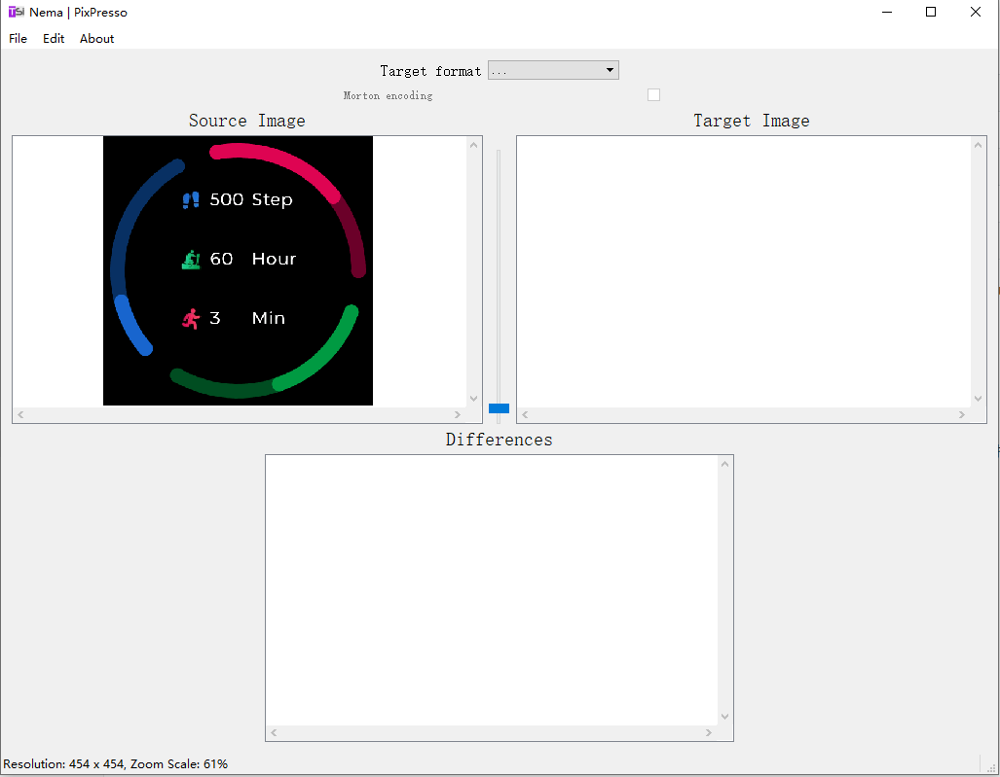

## GR5526 使用savebin调试GUI帧渲染问题


### 1. 背景

使用LVGL等GUI框架开发显示类应用时，可能会遇到绘制的UI或元素在屏幕上显示异常的问题。排查异常时，可分两个阶段进行分析：

- 第一阶段为渲染阶段：GUI框架渲染UI元素并输出到帧缓冲区Frame Buffer。

- 第二阶段为刷屏阶段：刷屏驱动接口将Frame Buffer中的数据送显到屏幕。

通过分析Frame Buffer的内容，可判断异常发生在渲染阶段还是刷屏阶段，随后进一步定位问题原因。


### 2. 分析Frame Buffer

#### 2.1 获取帧缓冲参数

在抓取Frame Buffer数据之前，需要先获取以下帧缓冲区参数。

- 帧缓冲区起始地址：如果采用双缓冲区，那么需获取两个缓冲区的地址。一般而言，可在系统启动分配缓冲区空间时将其打印出来。

  ```c
  void lv_port_disp_init(void)
  {
      /*-------------------------
       * Initialize your display
       * -----------------------*/
      disp_init();
  
      /*-----------------------------
       * Create two fixed frame buffers for drawing and never release it
       *----------------------------*/
      static lv_disp_draw_buf_t draw_buf_dsc;
  
      lv_color_t* _draw_buf1 = app_graphics_mem_malloc(DISP_HOR_RES * DISP_VER_RES * DISP_PIXEL_DEPTH);
      lv_color_t* _draw_buf2 = app_graphics_mem_malloc(DISP_HOR_RES * DISP_VER_RES * DISP_PIXEL_DEPTH);
      ......
      // 可将 _draw_buf1 & _draw_buf2 的地址 printf出来
  }
      
  ```

  

- 帧缓冲区大小：确定实际的缓冲区大小（长 x 宽 x 像素深度，单位为字节）。


#### 2.2 调试状态下抓取帧缓冲区数据

为复现问题，可选择在目标UI渲染后准备刷屏时执行以下操作：

- 程序上写入条件让程序在刷屏前Halt住。
- 进入调试模式，在渲染完成后准备刷屏的接口代码前断点停住。

```c
static void _disp_drv_flush(disp_drv_t * dev, void * buff, uint32_t buff_format, uint16_t w, uint16_t h) {
    graphics_hybrid_rm69330_flush(buff, buff_format, w, h); //lvgl 831 工程可在此增加断点暂停程序
}
```

待程序在目标位置停住后，通过J-Link连接设备。连接成功后，使用`savebin`命令抓取帧缓冲区数据，参考示例如下：

```c
//savebin <filename>, <addr>, <NumBytes> (hex)

J-Link>savebin D:/fb.rgba565 0x300A4A90 0x64A48
Opening binary file for writing... [D:/fb.rgba565]
Reading 412232 bytes from addr 0x300A4A90 into file...O.K.
```

上述示例将起始地址为0x300A4A90、大小为0x64A48（分辨率为454x454，格式为RGB565，大小为454 x 454 x 2字节，合0x64A48）的帧缓冲区数据Dump到D盘的*fb.rgba565*文件中。

- savebin需根据帧缓冲区的格式计算Size和设置文件格式：

| 常用帧缓冲区格式 | 对应枚举值 | 缓冲区大小公式 | 文件后缀  |
| ---------------- | ---------- | -------------- | --------- |
| RGBA565          | 0x05       | W x H x 2      | \.rgba565 |
| RGBA8888         | 0x06       | W x H x 4      | .rgba8888 |
| TSC4             | 0x12       | W x H / 2      | .tsc4     |
| TSC6或TSC6a      | 0x13/0x14  | W x H x 6 / 32 | .tsc6     |

- 双缓冲区每次刷屏时都会切换缓冲区，可以根据Fush的接口入参确定，不要Dump错误。


#### 2.3 检查缓冲区异常

1. 打开nema_pixpresso软件（位于[GrLvglImageTool](https://developers.goodix.com/zh/bbs/blog_detail/2996e8f9f352491eb0ccca468f28f2ce)软件的CmdTool目录下）。

2. 在nema_pixpresso中，打开2.2章节使用savebin命令所Dump的文件（打开文件时需注意填写正确的分辨率，否则会显示错误），如下图所示：



3. 查看渲染结果是否符合预期。

- 若效果不符合预期，则检查渲染阶段。
- 若效果符合预期，则可判断问题出现在刷屏阶段。
- 另外还有一种可能，即不小心修改了渲染和刷屏同步的代码，造成刷出去的帧缓冲区还没完成渲染。为避免出现这种情况，将双缓冲的使用同步即可。


